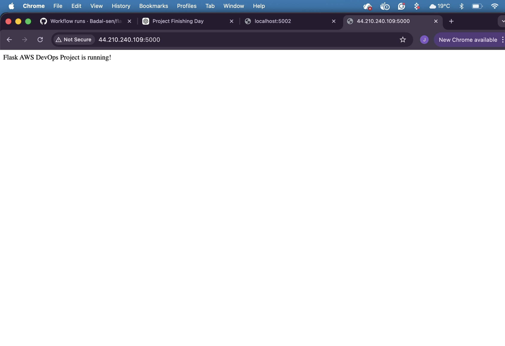
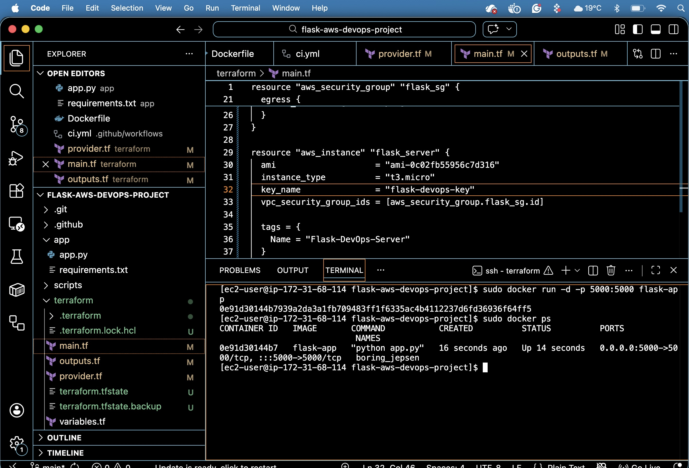

# 🚀 Flask AWS DevOps Project

This project demonstrates a complete DevOps workflow by deploying a Flask application on AWS using Docker and Terraform, along with CI/CD using GitHub Actions.

---

## 📌 Project Overview

In this project, I built and deployed a simple Flask web application using modern DevOps tools:

- Infrastructure provisioning with Terraform
- Containerization using Docker
- Deployment on AWS EC2
- CI/CD pipeline using GitHub Actions

---

## 🛠️ Tech Stack

- Python (Flask)
- Docker
- Terraform
- AWS (EC2, Security Groups)
- GitHub Actions (CI/CD)
- Linux

---

## ⚙️ Features

- Automated infrastructure setup using Terraform
- Dockerized Flask application
- CI pipeline to validate Terraform code
- Public access to deployed application
- Clean project structure with version control

---

## 📁 Project Structure

```
flask-aws-devops-project/
│
├── app/
│   ├── app.py
│   └── requirements.txt
│
├── terraform/
│   ├── main.tf
│   ├── provider.tf
│   ├── outputs.tf
│   └── variables.tf
│
├── .github/workflows/
│   └── ci.yml
│
├── screenshots/
│   ├── app-live.png
│   └── docker-terraform.png
│
├── Dockerfile
└── README.md
```

---

## 🚀 How It Works

### 1. Infrastructure (Terraform)
- Creates EC2 instance
- Configures security group (port 5000 open)
- Attaches key pair for SSH access

### 2. Application (Docker)
- Flask app containerized using Docker
- Runs on port 5000

### 3. Deployment
- SSH into EC2 instance
- Build Docker image
- Run container

### 4. CI/CD (GitHub Actions)
- Runs on every push
- Validates Terraform configuration

---

## 🧪 How to Run Locally

```bash
git clone https://github.com/Badal-sen/flask-aws-devops-project.git

cd flask-aws-devops-project

docker build -t flask-app .

docker run -d -p 5000:5000 flask-app
```

Open in browser:
```
http://localhost:5000
```

---

## 🌐 Live Application

```
http://44.210.240.109:5000
```

---

## 📸 Screenshots

### 🔹 Application Running


### 🔹 Docker & Terraform Setup


---

## 📚 What I Learned

- Infrastructure as Code (Terraform basics)
- Docker containerization
- AWS EC2 deployment
- CI/CD fundamentals using GitHub Actions
- Debugging real-world DevOps issues

---

## 🙌 Conclusion

This project helped me understand how different DevOps tools work together to build, deploy, and manage applications in a real-world environment.


## Update 1
Testing pull request
---

## 📬 Contact
